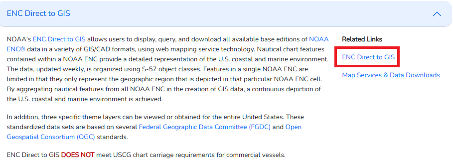
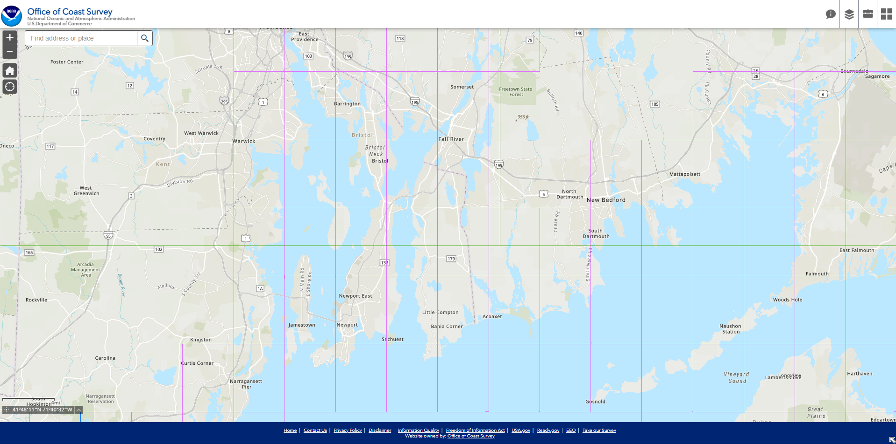
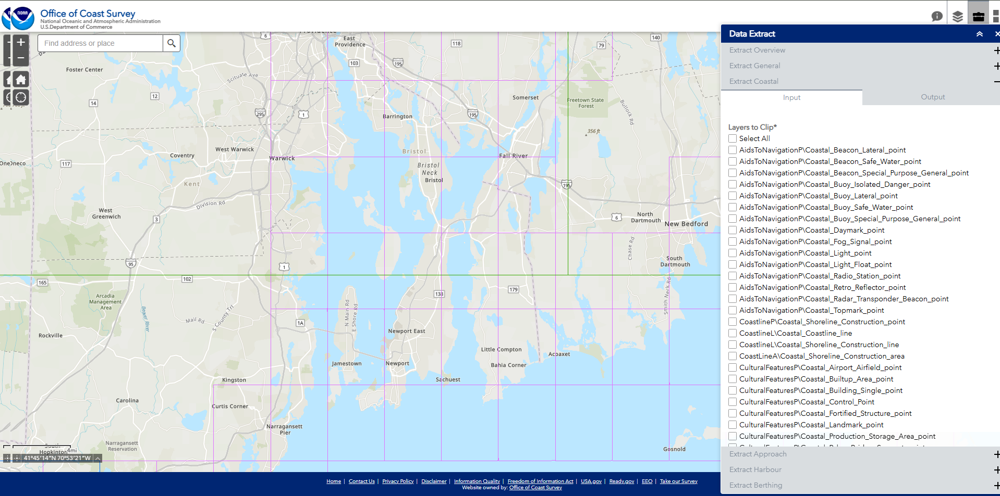
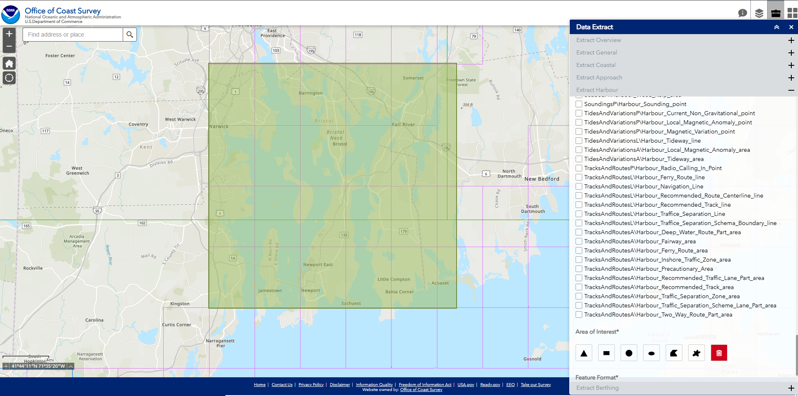
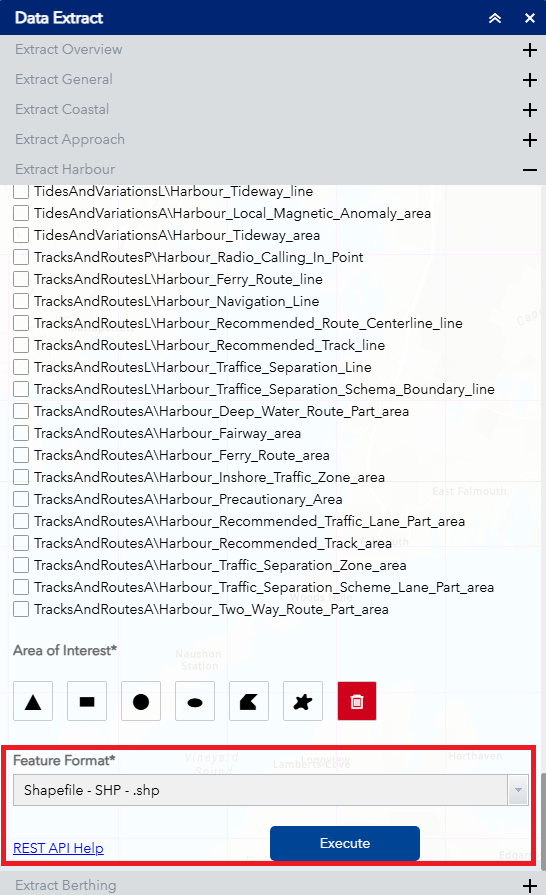

# UUV Genetic Algorithm Optimization
This project focus on the use of agent-based modeling to solve the problem of optimizing the placement of detection and counter UUV units in regard to a water-based scenario. This is a Python based project as Mesa was requested to be the main agent-based backend. Mesa is used as an agent-based library for helper functions like creation, proximity, and data collection. Tkinter was used for all user related graphics including maps and menus. Lastly, maps were made from the GIS data provided by the Office of Coast Survey.

This document covers the process of setting up and contributing while an in-depth code content is covered here.

# 😎 Teams
<!-- Additional teams include a new header for your project year -->
<!-- ex: ### Fall 2026 -->
### Fall 2025
* Gunner Cook-Dumas (SCRUM Manager, Backend, Agent, Model, and GA Structure)
* Justin Mosman (developer)
* Michael Cardinal (developer)
* Lauren Milne (SCRUM Product Owner)

# 🛠 Technical
Guide to setting up the project
## Prerequisites
* OS: Any
* Python 3.13.7
* VSCode (preferred)
## Structure
Your overall project structure should look as follows. When cloning the repo, make sure to make a overarching folder to contain both the repo and a virtual environment.
```
├── Project_name/    #name of project can what you want, not included in repo
│   ├── Simulation-Software/ # the git repo, what you clone
│   └── virtual environment/ # hold your local python, not included in repo
```

### repo structure
What is actually contain in the git repo ie. Simulation-Software
```
.
├── configs/              # config files
├── data/                 # Raw and processed datasets (Use Git LFS if needed!)
│   ├── raw/
│   ├── shape_files/
│   ├── test/
│   └── TIFF/
├── docs/                 # documentation and readme
├── resources/            # resources like graphics and icons
├── shape_filedata        # shape file data for maps
├── src/                  # src code
│   ├── agents/           # folder for all agent related files, recommend by Mesa
│   │   ├── agent.py
│   │   ├── CounterUUVAgnet.py
│   │   ├── detector_agent.py
│   │   ├── model.py 
│   │   ├── search_agent.py
│   │   └──  target_agent.py
│   ├── cell.py
│   ├── config.py
│   ├── grid.py
│   ├── gui.py
│   ├── main.py
│   ├── map.py
│   ├── New_gui.py
│   ├── salinity.py
│   └── temperature.py
├── log.txt 
└── README.md
```

## Installation
>[!NOTE]
>This installation will cover Windows, but similar steps for other OS, just slightly different commands.

1. Setup git account
2. Setup project folder
3. Clone the repo into project folder
```
git clone https://github.com/MrMosman/Simulation-Software.git
```
4. Create virtual environment in your project folder
```
py -m venv .venv
```
5. Activate venv
```
.venv\Scripts\activate
```
6. confirm activation. should the path of the python in the venv
```
where python
Project_folder\venv\Scripts\python.exe
```
7. Install requirements from repo
```
py -m pip install -r requirments.txt
```
8. Your final project should look as follows
```
├── Project_name/    
│   ├── Simulation-Software/ 
│   └── virtual environment/ 
```
# 🔍 How to use
## GIS Data
This sections covers where and how to get the mapping data for your simulations. The data used comes free from the U.S. Office of Coast Survey.
1. Go to the [U.S. Office of Coast Survey](https://nauticalcharts.noaa.gov/data/gis-data-and-services.html)
2. Click the ENC Direct to GIS drop down or use this [ENC Direct to GIS](https://encdirect.noaa.gov/)



3. Navigate towards a region, i choose Narragansett Bay



4. open data extract drop down menu



5. Choose any of the catagories, i need Harbour

6. Select DepthsA\Harbour_Depth_area.
>[!NOTE]
>The program can only handle .shp data. However, that data is verstiale and comes in lots of options 

>[!TIP]
> Try to use only data that ends in area ie. Harbour_Dredge_Area

7. Select the region to collect by using Area of Interest.



8. Extract the data as a .shp file



9. A download will appear and unzip the folder

### GIS Example

## Simulation Software
This section covers how to use the simulation software.
>[!NOTE]
>This covers how to do run in VS Code. Other code editors may be different
1. go to the main.py and start
2. This will open the simulation window


3. Navigate to the Map Selection and click "Select". This will open your file explorer.
4. Choose your GIS data which should be a shape file .shp. 
5. The map you selected will be rendered in the canvas
> [!NOTE] 
>The grid dots can be toggled in the code


6. Navigate to the Agent Selection and click "+ Add Agent". This will open a pop up.


7. Navigate to the Select UUV window.
8. With "Attacker" selected, choose seeker from dropdown, and click "Spawn". This will allow you to click on the map to set the spawn location of the attacking uuv agent.
9. Select "Defender" and choose "target" from the dropdown and spawn similarly.
10. Close the pop-up window.
11. Select "Choose Grid" next to Config Options to select the viable spawn locations for the detecting UUV agents used by the genetic algorithm.
12. Navigate to the Simulation Options and click "Start" to begin.

### Simulation Example
insert example

# ❗ Future Work & Handoff Notes
Everything in here is stored as an issue for portability.

## 🐞 BUGS
These are some pretty bad bugs and need to be fixed asap. Alot of the problems are created from using AI to write code.
* [#25](/../../issues/25)
* [#21](/../../issues/21)
* [#19](/../../issues/19)
* [#18](/../../issues/18)

## 📃 Documentation
At the time of writing this, no more updates are being added to the program as the semester has ended and no one is getting paid. Instead, everyone is trying to document what they did but there is still plenty that needs documenting
* [#35](/../../issues/35)
* [#29](/../../issues/29)
* [#28](/../../issues/28)
* [#26](/../../issues/26)

## Updates
These are issues that aren’t really problems but do need attention
* [#30](/../../issues/30)
* [#25](/../../issues/25)
* [#27](/../../issues/27)
* [#22](/../../issues/22)
* [#20](/../../issues/20)

## 🧬 Genetic Algorithm
These are request that Prof. Lance has made in regard to the latest genetic algorithm release. Currently, it works as intended and needs only slight modification to get these request to work. Mostly just changing single variables.
* [#33](/../../issues/33)
* [#32](/../../issues/32)
* [#31](/../../issues/31)
* [#24](/../../issues/24)
* [#23](/../../issues/23)


