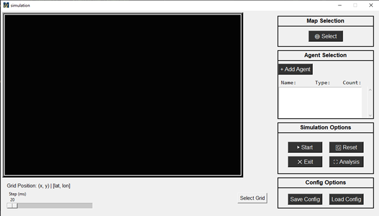

# UUV Genetic Algorithm Optimization
This project focus on the use of agent-based modeling to solve the problem of optimizing the placement of detection and counter UUV units in regard to a water-based scenario. This is a Python based project as Mesa was requested to be the main agent-based backend. Mesa is used as an agent-based library for helper functions like creation, proximity, and data collection. Tkinter was used for all user related graphics including maps and menus. Lastly, maps were made from the GIS data provided by the Office of Coast Survey.

This document covers the process of setting up and contributing while an indepth code content is coverd here.

# Teams
<!-- Addtionally teams include a new header for your project year -->
<!-- ex: ### Fall 2026 -->
### Fall 2025
* Gunner Cook-Dumas (SCRUM Manager, Backend, Agent, Model, and GA Stucture)
* Justin Mosman (developer)
* Michael Cardinal (developer)
* Lauren Milne (SCRUM Product Owner)

# Technical
Guide to setting up the project
## Prerequisites
* OS: Any
* Python 3.13.7
* VSCode (preferred)
## Structure
Your overall project structure should look as follows. When cloning the repo, make sure to make a overarching folder to contain both the repo and a virtual enviroment.
```
├── Project_name/    #name of project can what you want, not included in repo
│   ├── Simulation-Software/ # the git repo, what you clone
│   └── virtual environment/ # hold your local python, not included in repo
```

### repo structure
What is acutlly contain in the git repo ie. Simulation-Software
```
.
├── configs/              # config files
├── data/                 # Raw and processed datasets (Use Git LFS if needed!)
│   ├── raw/
│   ├── shape_files/
│   ├── test/
│   └── TIFF/
├── docs/                 # documenation and readme
├── resources/            # resources like graphics and icons
├── shape_filedata        # shape file data for maps
├── src/                  # src code
│   ├── agents/           # folder for all agent related files, recommend by Mesa
│   │   ├── agent.py
│   │   ├── CounterUUVAgnet.py
│   │   ├── detector_agent.py
│   │   ├── model.py 
│   │   ├── search_agent.py
│   │   └──  target_agent.py
│   ├── cell.py
│   ├── config.py
│   ├── grid.py
│   ├── gui.py
│   ├── main.py
│   ├── map.py
│   ├── New_gui.py
│   ├── salinity.py
│   └── temperature.py
├── log.txt 
└── README.md
```

## Installation
>[!NOTE]
>This installation will cover Windows, but similar steps for other OS, just slightly differnet commands.

1. Setup git account
2. Setup project folder
3. Clone the repo into project folder
```
git clone https://github.com/MrMosman/Simulation-Software.git
```
4. Create virtual enviroment in your project folder
```
py -m venv .venv
```
5. Activate venv
```
.venv\Scripts\activate
```
6. confirm activation. should should the path of the python in the venv
```
where python
Project_folder\venv\Scripts\python.exe
```
7. Install requirments from repo
```
py -m pip install -r requirments.txt
```
8. Your final project should look as follows
```
├── Project_name/    
│   ├── Simulation-Software/ 
│   └── virtual environment/ 
```
# How to use
## GIS Data
### GIS Example

## Simulation Software
>[!NOTE]
>This covers how to do run in VS Code. Other code editors may be differnet
1. go to the main.py and start
2. This will open the simulation window

3. Navigate to the Map Selection and click "Select". This will open your file exsplorer.
4. Choose your GIS data which should be a shape file .shp. 
5. The map you selected will be renderd in the canvas
> [!NOTE] The grid dots can be toggled in the code


6. Navigate to the Agent Selection and click "+ Add Agent". This will open a pop up.

7. Navigate to the Select UUV window.
8. With "Attacker" selected, choose seeker from dropdown, and click "Spawn". This will allow you to click on the map to set the spawn location of the attacking uuv agent.
9. Select "Defender" and choose "target" from the dropdown and spawn similary.
10. Close the pop-up window.
11. Select "Choose Grid" next to Config Options to select the viable spawn locations for the detecting UUV agents used by the genetic algorithum.
12. Navigate to the Simulation Options and click "Start" to begin.
### Simulation Example
insert example

# Future Work & Handoff Notes