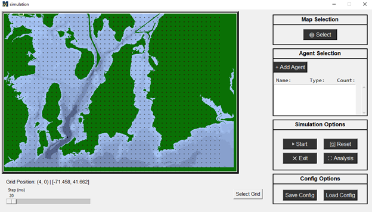
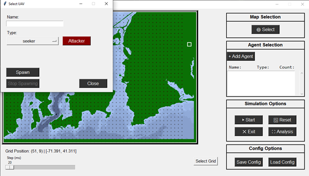

# Operation Manual 

## GIS Data
This section covers where and how to get the mapping data for your simulations. The data used comes free from the U.S. Office of Coast Survey.
1. Go to the [U.S. Office of Coast Survey](https://nauticalcharts.noaa.gov/data/gis-data-and-services.html)
2. Click the ENC Direct to GIS drop down or use this [ENC Direct to GIS](https://encdirect.noaa.gov/)

3. Navigate towards a region, i choose Narragansett Bay

4. open data extract drop down menu

5. Choose any of the categories, i need Harbor

6. Select DepthsA\Harbour_Depth_area.
>[!NOTE]
>The program can only handle .shp data. However, that data is versatile and comes in lots of options 

>[!TIP]
> Try to use only data that ends in area ie. Harbour_Dredge_Area

7. Select the region to collect by using Area of Interest.

8. Extract the data as a .shp file

9. A download will appear and unzip the folder

### GIS Example

## Simulation Software
This section covers how to use simulation software.
>[!NOTE]
>This covers how to run in VS Code. Other code editors may be different
1. go to the main.py and start
2. This will open the simulation window

3. Navigate to the Map Selection and click "Select". This will open your file explorer.
4. Choose your GIS data which should be a shape file .shp. 
5. The map you selected will be rendered in the canvas
> [!NOTE] 
>The grid dots can be toggled in the code

6. Navigate to the Agent Selection and click "+ Add Agent". This will open a pop up.

7. Navigate to the Select UUV window.
8. With "Attacker" selected, choose seeker from dropdown, and click "Spawn". This will allow you to click on the map to set the spawn location of the attacking uuv agent.
9. Select "Defender" and choose "target" from the dropdown and spawn similarly.
10. Close the pop-up window.
11. Select "Choose Grid" next to Config Options to select the viable spawn locations for the detecting UUV agents used by the genetic algorithm.
12. Navigate to the Simulation Options and click "Start" to begin.

### Simulation Example
insert example
